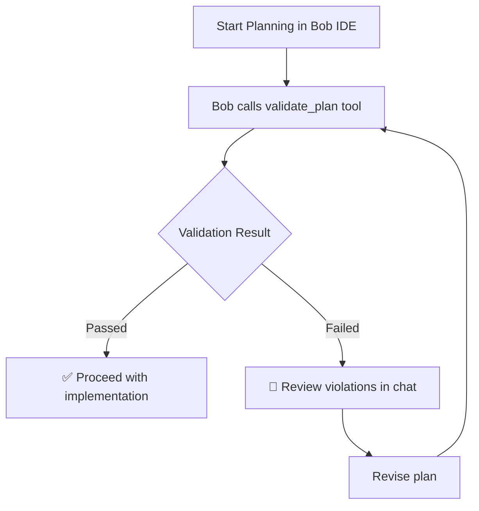

# In-IDE Validation Guide

ArchGuard now provides **seamless in-IDE validation** - no more switching to terminals or external dashboards! All validation feedback appears directly in Bob IDE's chat interface.

## 🎯 Key Benefits

- ✅ **Stay in Flow**: Validation results appear directly in Bob IDE chat
- ✅ **No Terminal Needed**: No need to check separate dashboard or terminal output
- ✅ **Instant Feedback**: See violations immediately with clear, actionable guidance
- ✅ **Auto-Generated Rules**: Create `.bob/rules` files automatically for any mode
- ✅ **Severity-Based**: Violations categorized by priority (Critical → Low)

## 🚀 Quick Start

### 1. Automatic Bob Rules Generation

Use the new `create_bob_rules` MCP tool to automatically generate mode-specific rules:

```typescript
// In Bob IDE, the MCP tool will be called automatically
// Or you can trigger it manually:
use_mcp_tool("archguard", "create_bob_rules", {
  mode: "code",  // or "plan", "ask", "advanced", etc.
  project_context: "Optional: Add project-specific context here"
})
```

This creates `.bob/rules-{mode}/AGENTS.md` with all your architectural guardrails integrated.

### 2. Validation During Planning

When you use a mode with ArchGuard rules:

1. **Plan your changes** in Bob IDE as usual
2. **Automatic validation** happens via the `validate_plan` tool
3. **Results appear in chat** with clear, formatted feedback
4. **Iterate if needed** - revise and validate again

## 📊 Validation Result Format

### ✅ Passed Validation

```markdown
✅ **ARCHITECTURAL VALIDATION PASSED**

All architectural guardrails passed. No violations detected.

You may proceed with implementation.
```

### 🚫 Failed Validation

```markdown
🚫 **ARCHITECTURAL VALIDATION FAILED**

**Summary:** Found 2 violation(s). Critical: 1, High: 1

## 🔴 CRITICAL VIOLATIONS (Must Fix)

### 1. Direct Database Access
**Rule ID:** `no-direct-db-access`
**Issue:** The plan proposes direct database queries in the UI layer. All database access must go through the service layer.

## 🟠 HIGH SEVERITY VIOLATIONS (Should Fix)

### 1. Missing Authentication
**Rule ID:** `require-auth-middleware`
**Issue:** New route does not include authentication middleware. All routes must be protected.

---

## 📋 Next Steps

⚠️ **CRITICAL violations must be resolved before proceeding.**

Please revise your plan to address the critical issues above, then I'll validate again.

<details>
<summary>📊 Raw Validation Data (JSON)</summary>

```json
{
  "isValid": false,
  "violations": [...],
  "summary": "..."
}
```

</details>
```

## 🛠️ Available MCP Tools

### 1. `validate_plan`

Validates an architectural plan against project guardrails.

**Input:**
```json
{
  "plan": "Your architectural plan or code changes description"
}
```

**Output:** Formatted validation result in Bob IDE chat

### 2. `create_bob_rules`

Automatically creates `.bob/rules-{mode}/AGENTS.md` with guardrails.

**Input:**
```json
{
  "mode": "code",  // Required: Bob mode name
  "project_context": "Optional project-specific context"
}
```

**Output:** Success message with file location

## 📁 File Structure

After using `create_bob_rules`, your project will have:

```
.bob/
├── rules-code/
│   └── AGENTS.md          # Code mode guardrails
├── rules-plan/
│   └── AGENTS.md          # Plan mode guardrails
├── rules-ask/
│   └── AGENTS.md          # Ask mode guardrails
└── rules-{custom}/
    └── AGENTS.md          # Custom mode guardrails
```

Each `AGENTS.md` contains:
- Mode-specific architectural guardrails
- Severity-categorized rules (Critical → Low)
- Validation workflow instructions
- Project-specific context (if provided)

## 🎨 Severity Levels

| Emoji | Severity | Meaning | Action Required |
|-------|----------|---------|-----------------|
| 🔴 | **CRITICAL** | Must never violate | **BLOCKING** - Must fix before proceeding |
| 🟠 | **HIGH** | Should not violate | **STRONGLY RECOMMENDED** - Should fix |
| 🟡 | **MEDIUM** | Consider carefully | **RECOMMENDED** - Consider fixing |
| 🔵 | **LOW** | Best practices | **OPTIONAL** - Fix if time permits |

## 🔄 Validation Workflow



## 💡 Best Practices

### 1. Create Rules Early
```bash
# Generate rules for all modes you use
create_bob_rules({ mode: "code" })
create_bob_rules({ mode: "plan" })
create_bob_rules({ mode: "advanced" })
```

### 2. Review Violations Carefully
- **Critical violations** are blocking - must be fixed
- **High violations** indicate serious architectural issues
- **Medium/Low violations** are recommendations

### 3. Iterate on Plans
- Don't rush to implementation with violations
- Revise your plan based on feedback
- Validate again until all critical issues are resolved

### 4. Keep .bobrules.json Updated
- The `.bobrules.json` file is the source of truth
- Update it as your architecture evolves
- Regenerate `.bob/rules` files after updates

## 🆚 Comparison: Old vs New

### ❌ Old Way (Terminal Dashboard)

1. Plan changes in Bob IDE
2. **Switch to terminal** to check validation
3. **Open browser** to view dashboard
4. **Context switch** back to IDE
5. Revise plan
6. Repeat...

### ✅ New Way (In-IDE)

1. Plan changes in Bob IDE
2. **See validation results in chat** immediately
3. Revise plan in same window
4. Validate again
5. Done! 🎉

## 🔧 Configuration

### MCP Server Configuration

Ensure your Bob IDE MCP settings include:

```json
{
  "mcpServers": {
    "archguard": {
      "command": "node",
      "args": ["path/to/archguard/dist/mcp/index.js"]
    }
  }
}
```

### Environment Variables

Required for validation:
```env
WATSONX_API_KEY=your_ibm_cloud_api_key
WATSONX_PROJECT_ID=your_watsonx_project_id
WATSONX_ENDPOINT=https://us-south.ml.cloud.ibm.com  # Optional
```

## 🐛 Troubleshooting

### Validation Not Appearing in Chat

1. **Check MCP server is running**: `npm run dev`
2. **Verify .bobrules.json exists**: Should be in project root or `config/`
3. **Check environment variables**: Ensure watsonx.ai credentials are set
4. **Restart Bob IDE**: Sometimes needed after MCP config changes

### Rules Not Loading

1. **Regenerate rules**: Use `create_bob_rules` tool again
2. **Check file location**: Should be `.bob/rules-{mode}/AGENTS.md`
3. **Verify mode name**: Must match Bob IDE mode exactly

### Validation Errors

1. **Check watsonx.ai credentials**: Ensure API key and project ID are valid
2. **Review .bobrules.json**: Ensure valid JSON format
3. **Check network**: Ensure connection to IBM Cloud

## 📚 Related Documentation

- [Quick Start Guide](./QUICK_START.md)
- [Secure Planner Guide](./SECURE_PLANNER_GUIDE.md)
- [Global Installation](./GLOBAL_INSTALLATION.md)

## 🎓 Example Usage

### Creating Rules for Code Mode

```typescript
// Bob IDE will call this automatically, or you can trigger it:
use_mcp_tool("archguard", "create_bob_rules", {
  mode: "code",
  project_context: `
    WoRide Project Context:
    - Layered architecture: UI → Service → DB
    - Payment providers must be isolated services
    - All routes require authentication
    - USSD and mobile app share service layer
  `
})
```

### Validating a Plan

```typescript
// This happens automatically when you plan in Bob IDE
use_mcp_tool("archguard", "validate_plan", {
  plan: `
    Create a new user registration endpoint:
    1. Add POST /api/users/register route
    2. Validate email and password
    3. Hash password with bcrypt
    4. Store user in database
    5. Return JWT token
  `
})
```

## 🎉 Summary

ArchGuard's in-IDE validation eliminates context switching and keeps you in flow:

- ✅ **No terminal needed** - everything in Bob IDE chat
- ✅ **Automatic rule generation** - one command creates all mode rules
- ✅ **Clear, actionable feedback** - severity-based, formatted results
- ✅ **Seamless workflow** - plan → validate → iterate → implement

**Start using it now:** Just use `create_bob_rules` to generate your mode rules, then plan as usual in Bob IDE!